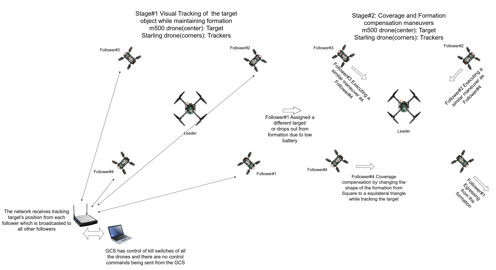
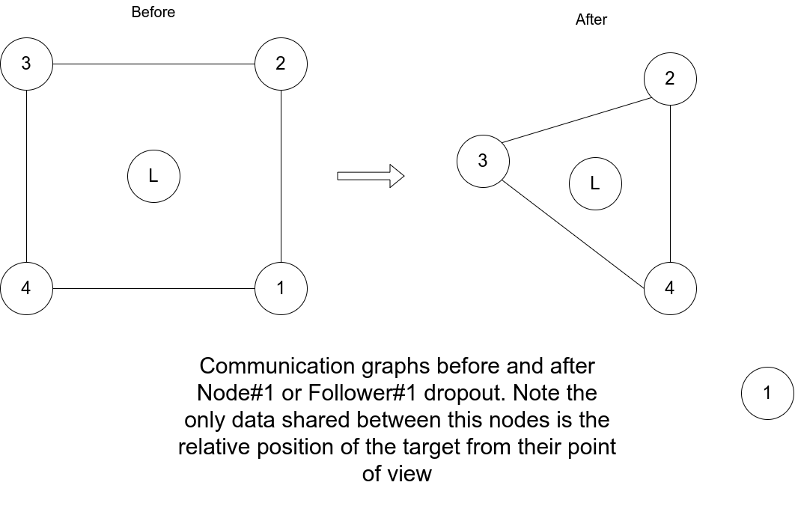
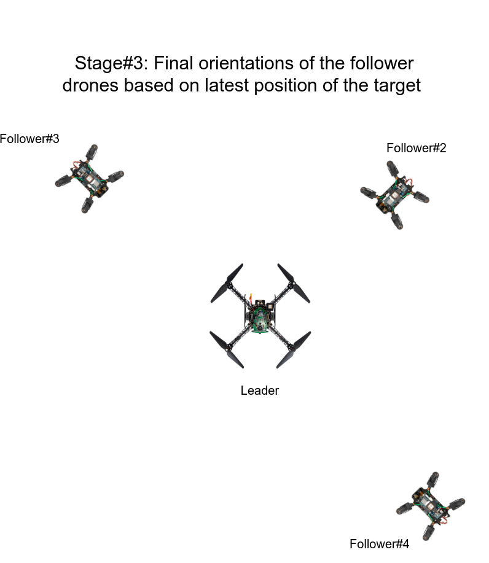

# Project LegionAir

## Introduction
This document summarizes the project proposal for the Swarm Robotics course Research project. 
The project aims to emulate a swarm formation of a roman legion where if a single comrade falls out of formation there is a readjustment of the 
whole formation such that the coverage can be maximized.

Swarming behavior using vision is quite common in the animal kingdom, birds flock together while migrating to locations and maintain formation at the same time just based on limited field of view vision sensors. Our motivation is to use a similar limited FOV swarm of drones to track a mother ship drone in the center at the same time maintaining the formation while the the mother ship guides the flock to the designated target. The second stage of the project involves emulating Roman legion tactics of replacing and maintaining coverage of troops. Roman legions functioned using continuous funneling of troops to the front lines so that exhausted troops can rest or recuperate while at the same time fallen soldiers can be replaced. 
Our objective would be to emulate the second formation where one of the drones in the flock looses track or is sent on a scouting mission ahead, 
while the slower moving mother ship and it's flock reorients itself to account for the missing drone.

* The below image shows the stages through which the swarm will execute a coverage compensation maneuver using just visual data of the tracked target

* The below image shows the change in communication graphs of the drones, here nodes means drones:

* The next image shows the final formation:

## Sensors and Hardware

Each of the follower and a leader drone uses Visual Inertial Odometry taken out from the fisheye camera mounted on the drones for its local position estimate. The follower drones track the leader drone using a hires RGB sensor and a Time of Flight sensor which fuse together using late-sensor fusion to get the position of the target

## Milestones

- [. ] Collect data and retrain the Yolov5n model to identify m500 drone
- [ ] Move the model to the drone's gpu, test for inference speed
- [ ] Collect rosbag while both the follower and leader drones fly for testing sensor fusion
- [ ] Write the ros node for sensor fusion and test the FPS with the rosbag
- [ ] Convert ROS nodes written in python to C++ for high speed vectorization with Eigen3 library
- [ ] Make builds for Arm64 linux computer and test the build run while on the ground
- [ ] In the constructor, debug to ensure that the weight registration happens seamlessly.
